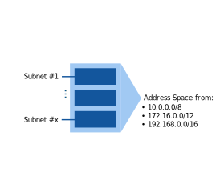
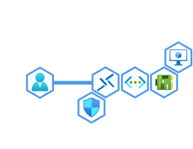
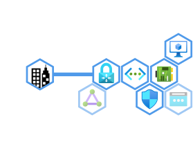

# Intro to Azure Network Security
<!-- _class: right -->
Presented by Jurijs Fadejevs

---

## Introduction

<!-- paginate: true -->
<!-- header: 'Intro to Azure Network Security' -->
<!-- footer: 'https://github.com/groovy-sky' -->

---

## Roadmap

---

## VNet: Definition

---

## VNet: Address space & Subnets

---

## VNet: NSG

---

## VM in VNet

---

## VM access using Azure Bastion

---

## VM's public access

---

## VNet: Peerings

---

## VM's private access

---

## VNet: Service Endpoints

---

## VNet: Private Endpoints 

---

## Private Endpoints access from Azure VM

---

## Private Endpoints access from On-Prem

---

## Summary

---

<!-- header: '' -->
<!-- footer: '' -->
<!-- paginate: false -->
# Thanks for listening

---

## Related links

**Running self-hosted DNS forwarder using CoreDNS:**
[https://github.com/groovy-sky/azure/tree/master/docker-coredns-00](https://github.com/groovy-sky/azure/tree/master/docker-coredns-00)

**More about Azure:**
[https://groovy-sky.github.io/azure/](https://groovy-sky.github.io/azure/)

