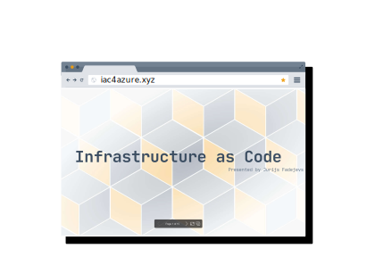
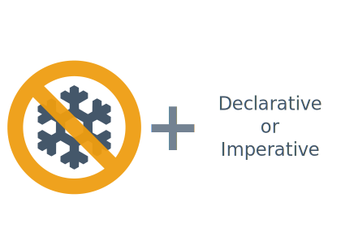
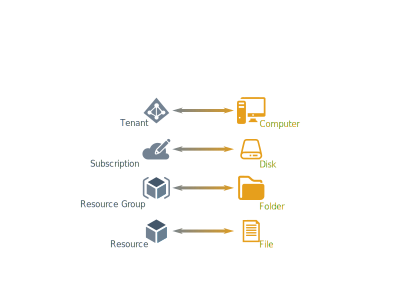
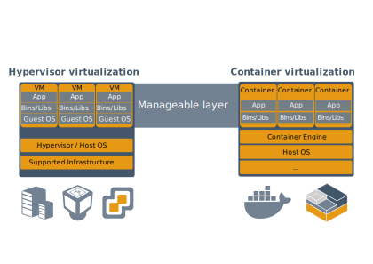
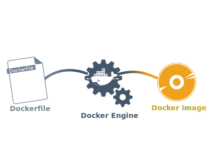

<!-- background-image: url("https://raw.githubusercontent.com/groovy-sky/iac-presentation/main/presentation/img/bg.jpg"); -->
# Infrastructure as Code
<!-- _class: right -->
Presented by Jurijs Fadejevs

---

## Before we start

---

<!-- paginate: true -->
<!-- header: 'Infrastructure as Code' -->
<!-- footer: 'https://github.com/groovy-sky' -->

## Introduction

---

## What is Infrastructure as Code?

---

## Roadmap

---

<!-- _footer: 'https://github.com/groovy-sky/azure/tree/master/iac-00#introduction' -->
## Azure Resource Manager

---

<!-- _footer: 'https://github.com/groovy-sky/azure/tree/master/iac-00#introduction' -->
## Azure Resource Manager

---

## Ansible

<!-- _footer: 'https://github.com/groovy-sky/azure/tree/master/iac-01#introduction' -->

---

https://docs.ansible.com/ansible/2.9/modules/list_of_cloud_modules.html#azure

---

## Docker

<!-- _footer: 'https://github.com/groovy-sky/azure/tree/master/iac-02#introduction' -->

---

## Docker

<!-- _footer: 'https://github.com/groovy-sky/azure/tree/master/iac-02#introduction' -->

---

## Azure DevOps

<!-- _footer: 'https://github.com/groovy-sky/azure/tree/master/iac-03#introduction' -->

---

<!-- _footer: 'https://github.com/groovy-sky/azure/tree/master/iac-04#introduction' -->
## Power Automate

---

## Result

---

## Summary

---
