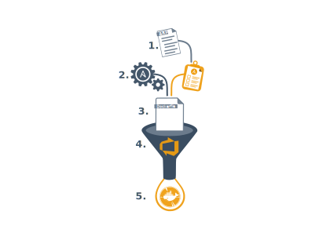

# Infrastructure as Code
<!-- _class: right -->
Presented by Jurijs Fadejevs

---

## Before we start

---

<!-- paginate: true -->
<!-- header: 'Infrastructure as Code' -->
<!-- footer: 'https://github.com/groovy-sky' -->

## Introduction

---

## What is Infrastructure as Code?

---

## Roadmap

---

<!-- _footer: 'https://github.com/groovy-sky/azure/tree/master/iac-00#introduction' -->
## Azure Resource Manager

---

<!-- _footer: 'https://github.com/groovy-sky/azure/tree/master/iac-00#introduction' -->
## Azure Resource Manager

---

## Ansible

<!-- _footer: 'https://github.com/groovy-sky/azure/tree/master/iac-01#introduction' -->

---

## Ansible

<!-- _footer: 'https://github.com/groovy-sky/azure/tree/master/iac-01#introduction' -->

---

## Docker

<!-- _footer: 'https://github.com/groovy-sky/azure/tree/master/iac-02#introduction' -->

---

## Docker

<!-- _footer: 'https://github.com/groovy-sky/azure/tree/master/iac-02#introduction' -->

---

## Azure DevOps

<!-- _footer: 'https://github.com/groovy-sky/azure/tree/master/iac-03#introduction' -->

---

<!-- _footer: 'https://github.com/groovy-sky/azure/tree/master/iac-04#introduction' -->
## Power Automate

---

## IaC Formula

---

## Result

---

## Summary

---

## Related information

<!-- _font-size: 35px; -->
<!-- _a.font-size: 35px; -->

IaC - [https://github.com/groovy-sky/iaac-demo](https://github.com/groovy-sky/iaac-demo)
More about Azure - https://groovy-sky.github.io/azure/

---